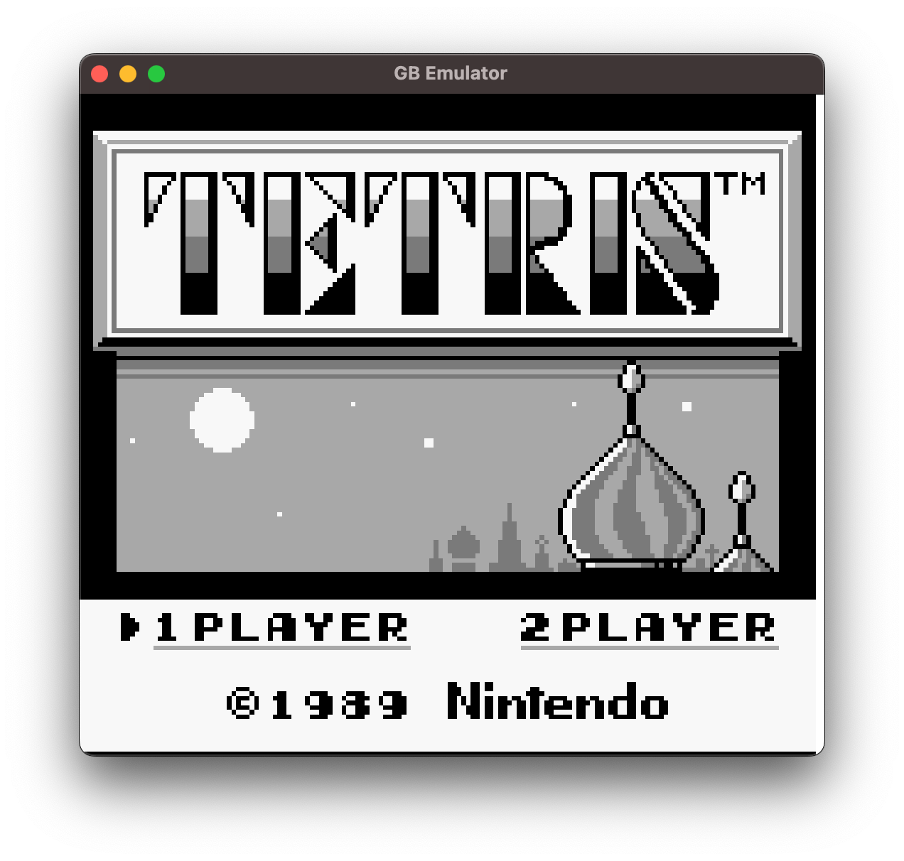
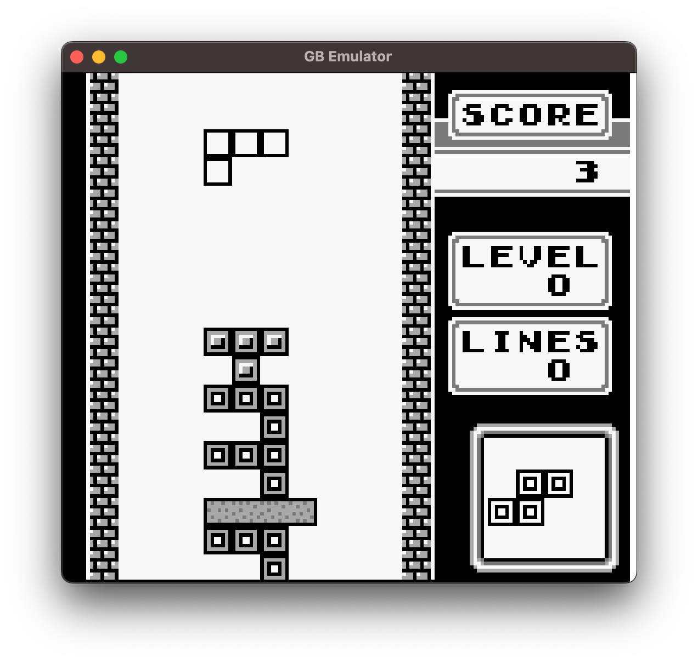

# Game Boy Emulator in Rust

A partial Game Boy emulator written in Rust.

It's nowhere near complete, but it can run Tetris.




## Usage

Ensure you have [Rust installed](https://www.rust-lang.org/tools/install), and build using:

```shell
cargo run --release -- PATH_TO_ROM_FILE
```

## Done

- The cpu passes the Blargg cpu test.
- Most of the PPU (video)
- Some of the APU (audio)
- MBC0 and MBC1

## Todo

- Fix PPU bugs so other games can be played.
- Finish APU
- Add more MBC's

## Resources

- https://gbdev.io/pandocs/
- https://meganesu.github.io/generate-gb-opcodes/
